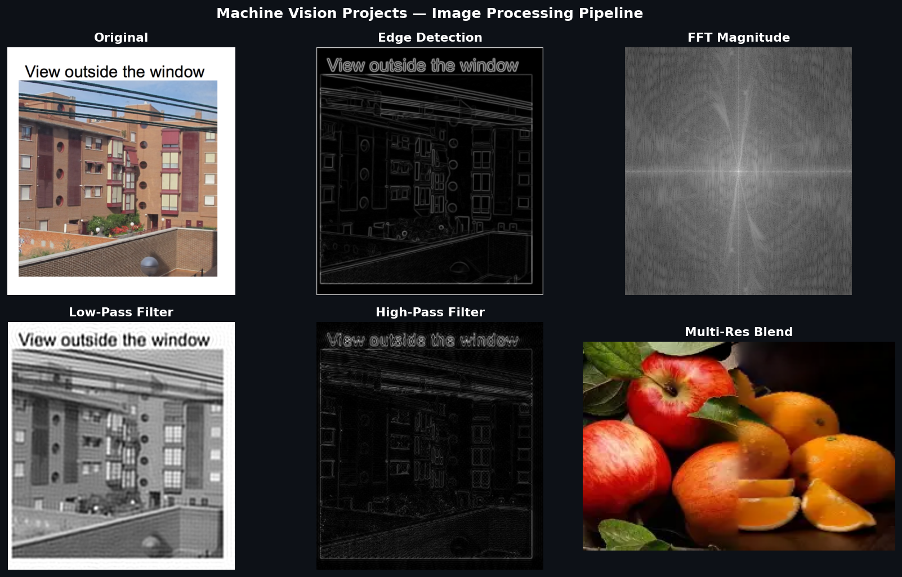

# Machine Vision Projects

**Arizona State University — EEE515 Machine Vision | Author: Luna Sbahtu**

A collection of computer vision projects covering classical image processing, deep learning-based visual analysis, and motion analysis using OpenCV, PyTorch, and HuggingFace Transformers.



---

## Projects

### 1. Image Processing
**[image-processing/](./image-processing/)**

Classical image processing pipeline built with NumPy and OpenCV:
- FFT frequency analysis (magnitude & phase)
- Low-pass and high-pass frequency filtering
- Edge detection — Sobel, Laplacian, and custom Canny
- Gaussian and Laplacian pyramid construction
- Multi-resolution image blending
- Image downsampling and upsampling (nearest neighbor & bilinear)
- Hybrid image generation

### 2. Deep Learning Vision
**[deep-learning-vision/](./deep-learning-vision/)**

Visual analysis pipeline using HuggingFace Transformers and PyTorch:
- Pre-trained model inference on custom images
- Image feature extraction and visualization
- Integration with OpenCV for pre/post-processing

### 3. Motion Analysis
**[motion-analysis/](./motion-analysis/)**

Video and motion understanding using deep learning:
- Frame-by-frame video analysis
- Motion feature extraction using transformer models
- Visualization of temporal patterns

---

## Tech Stack

- Python
- OpenCV
- NumPy
- PyTorch
- HuggingFace Transformers
- Matplotlib
- Pillow

## Usage

```bash
pip install -r requirements.txt
jupyter notebook
```
